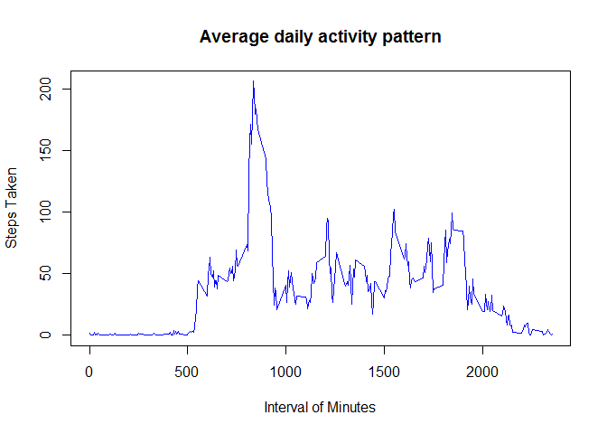
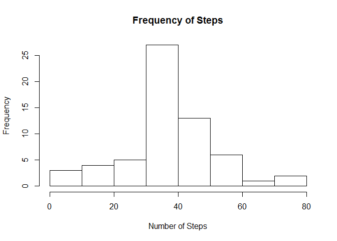

# Reproducible Research: Peer Assessment 1


First we prepare the environment to proceed with analysis.  
we must:   
1. Provide plotting libraries for graph reproduction   
2. And Set Environment variables   


```r
library('knitr')
library('xtable')
library('ggplot2')
library('lattice')
##Set the global options for defaults in document processing
opts_chunk$set(echo=FALSE,results="hide" , message=FALSE, warning=FALSE);
Sys.setlocale("LC_TIME", "English")
```


## Loading and preprocessing the data

In this section we only load data

```r
activity<-read.csv("./activity/activity.csv")
#summary(activity)
#head(activity)
```


## What is mean total number of steps taken per day?

First we use the Aggregate Framework to grou and calculate the mean steps by date, 
note  that there are other packages that provides 
the same functionality like for example  dplyr


```r
stepsByDay<-aggregate(activity$steps,by=list(day=activity$date),FUN=mean)

#The table using xtable
tab <- xtable(stepsByDay)
print(tab, type="html")
```

<!-- html table generated in R 3.2.1 by xtable 1.8-0 package -->
<!-- Sun Dec 20 21:48:55 2015 -->
<table border=1>
<tr> <th>  </th> <th> day </th> <th> x </th>  </tr>
  <tr> <td align="right"> 1 </td> <td> 2012-10-01 </td> <td align="right">  </td> </tr>
  <tr> <td align="right"> 2 </td> <td> 2012-10-02 </td> <td align="right"> 0.44 </td> </tr>
  <tr> <td align="right"> 3 </td> <td> 2012-10-03 </td> <td align="right"> 39.42 </td> </tr>
  <tr> <td align="right"> 4 </td> <td> 2012-10-04 </td> <td align="right"> 42.07 </td> </tr>
  <tr> <td align="right"> 5 </td> <td> 2012-10-05 </td> <td align="right"> 46.16 </td> </tr>
  <tr> <td align="right"> 6 </td> <td> 2012-10-06 </td> <td align="right"> 53.54 </td> </tr>
  <tr> <td align="right"> 7 </td> <td> 2012-10-07 </td> <td align="right"> 38.25 </td> </tr>
  <tr> <td align="right"> 8 </td> <td> 2012-10-08 </td> <td align="right">  </td> </tr>
  <tr> <td align="right"> 9 </td> <td> 2012-10-09 </td> <td align="right"> 44.48 </td> </tr>
  <tr> <td align="right"> 10 </td> <td> 2012-10-10 </td> <td align="right"> 34.38 </td> </tr>
  <tr> <td align="right"> 11 </td> <td> 2012-10-11 </td> <td align="right"> 35.78 </td> </tr>
  <tr> <td align="right"> 12 </td> <td> 2012-10-12 </td> <td align="right"> 60.35 </td> </tr>
  <tr> <td align="right"> 13 </td> <td> 2012-10-13 </td> <td align="right"> 43.15 </td> </tr>
  <tr> <td align="right"> 14 </td> <td> 2012-10-14 </td> <td align="right"> 52.42 </td> </tr>
  <tr> <td align="right"> 15 </td> <td> 2012-10-15 </td> <td align="right"> 35.20 </td> </tr>
  <tr> <td align="right"> 16 </td> <td> 2012-10-16 </td> <td align="right"> 52.38 </td> </tr>
  <tr> <td align="right"> 17 </td> <td> 2012-10-17 </td> <td align="right"> 46.71 </td> </tr>
  <tr> <td align="right"> 18 </td> <td> 2012-10-18 </td> <td align="right"> 34.92 </td> </tr>
  <tr> <td align="right"> 19 </td> <td> 2012-10-19 </td> <td align="right"> 41.07 </td> </tr>
  <tr> <td align="right"> 20 </td> <td> 2012-10-20 </td> <td align="right"> 36.09 </td> </tr>
  <tr> <td align="right"> 21 </td> <td> 2012-10-21 </td> <td align="right"> 30.63 </td> </tr>
  <tr> <td align="right"> 22 </td> <td> 2012-10-22 </td> <td align="right"> 46.74 </td> </tr>
  <tr> <td align="right"> 23 </td> <td> 2012-10-23 </td> <td align="right"> 30.97 </td> </tr>
  <tr> <td align="right"> 24 </td> <td> 2012-10-24 </td> <td align="right"> 29.01 </td> </tr>
  <tr> <td align="right"> 25 </td> <td> 2012-10-25 </td> <td align="right"> 8.65 </td> </tr>
  <tr> <td align="right"> 26 </td> <td> 2012-10-26 </td> <td align="right"> 23.53 </td> </tr>
  <tr> <td align="right"> 27 </td> <td> 2012-10-27 </td> <td align="right"> 35.14 </td> </tr>
  <tr> <td align="right"> 28 </td> <td> 2012-10-28 </td> <td align="right"> 39.78 </td> </tr>
  <tr> <td align="right"> 29 </td> <td> 2012-10-29 </td> <td align="right"> 17.42 </td> </tr>
  <tr> <td align="right"> 30 </td> <td> 2012-10-30 </td> <td align="right"> 34.09 </td> </tr>
  <tr> <td align="right"> 31 </td> <td> 2012-10-31 </td> <td align="right"> 53.52 </td> </tr>
  <tr> <td align="right"> 32 </td> <td> 2012-11-01 </td> <td align="right">  </td> </tr>
  <tr> <td align="right"> 33 </td> <td> 2012-11-02 </td> <td align="right"> 36.81 </td> </tr>
  <tr> <td align="right"> 34 </td> <td> 2012-11-03 </td> <td align="right"> 36.70 </td> </tr>
  <tr> <td align="right"> 35 </td> <td> 2012-11-04 </td> <td align="right">  </td> </tr>
  <tr> <td align="right"> 36 </td> <td> 2012-11-05 </td> <td align="right"> 36.25 </td> </tr>
  <tr> <td align="right"> 37 </td> <td> 2012-11-06 </td> <td align="right"> 28.94 </td> </tr>
  <tr> <td align="right"> 38 </td> <td> 2012-11-07 </td> <td align="right"> 44.73 </td> </tr>
  <tr> <td align="right"> 39 </td> <td> 2012-11-08 </td> <td align="right"> 11.18 </td> </tr>
  <tr> <td align="right"> 40 </td> <td> 2012-11-09 </td> <td align="right">  </td> </tr>
  <tr> <td align="right"> 41 </td> <td> 2012-11-10 </td> <td align="right">  </td> </tr>
  <tr> <td align="right"> 42 </td> <td> 2012-11-11 </td> <td align="right"> 43.78 </td> </tr>
  <tr> <td align="right"> 43 </td> <td> 2012-11-12 </td> <td align="right"> 37.38 </td> </tr>
  <tr> <td align="right"> 44 </td> <td> 2012-11-13 </td> <td align="right"> 25.47 </td> </tr>
  <tr> <td align="right"> 45 </td> <td> 2012-11-14 </td> <td align="right">  </td> </tr>
  <tr> <td align="right"> 46 </td> <td> 2012-11-15 </td> <td align="right"> 0.14 </td> </tr>
  <tr> <td align="right"> 47 </td> <td> 2012-11-16 </td> <td align="right"> 18.89 </td> </tr>
  <tr> <td align="right"> 48 </td> <td> 2012-11-17 </td> <td align="right"> 49.79 </td> </tr>
  <tr> <td align="right"> 49 </td> <td> 2012-11-18 </td> <td align="right"> 52.47 </td> </tr>
  <tr> <td align="right"> 50 </td> <td> 2012-11-19 </td> <td align="right"> 30.70 </td> </tr>
  <tr> <td align="right"> 51 </td> <td> 2012-11-20 </td> <td align="right"> 15.53 </td> </tr>
  <tr> <td align="right"> 52 </td> <td> 2012-11-21 </td> <td align="right"> 44.40 </td> </tr>
  <tr> <td align="right"> 53 </td> <td> 2012-11-22 </td> <td align="right"> 70.93 </td> </tr>
  <tr> <td align="right"> 54 </td> <td> 2012-11-23 </td> <td align="right"> 73.59 </td> </tr>
  <tr> <td align="right"> 55 </td> <td> 2012-11-24 </td> <td align="right"> 50.27 </td> </tr>
  <tr> <td align="right"> 56 </td> <td> 2012-11-25 </td> <td align="right"> 41.09 </td> </tr>
  <tr> <td align="right"> 57 </td> <td> 2012-11-26 </td> <td align="right"> 38.76 </td> </tr>
  <tr> <td align="right"> 58 </td> <td> 2012-11-27 </td> <td align="right"> 47.38 </td> </tr>
  <tr> <td align="right"> 59 </td> <td> 2012-11-28 </td> <td align="right"> 35.36 </td> </tr>
  <tr> <td align="right"> 60 </td> <td> 2012-11-29 </td> <td align="right"> 24.47 </td> </tr>
  <tr> <td align="right"> 61 </td> <td> 2012-11-30 </td> <td align="right">  </td> </tr>
   </table>
After the table we calculate the histogram, we see that 
there is more frequent to take 40 steps by day


```r
stepsByDay$dday<-as.Date(stepsByDay$day,format="%Y-%m-%d")
hist(stepsByDay$x,xlab = 'Number of Steps',main = 'Frequency of Steps')
```

 


```r
stepsMean<-mean(stepsByDay$x,na.rm = TRUE)
stepsMedian<-median(stepsByDay$x,na.rm = TRUE)
```
###we get the mean 37.3825996 and Median is 37.3784722  
they are very close, note the histogram is almost symmetric.

No necessary but we plot with the linear regression.


```r
linearModel<-lm( x~dday, data=stepsByDay)
plot(stepsByDay$dday,stepsByDay$x,xlab='Date',ylab = 'Steps',main = 'Steps  by Day',col='blue')
abline(linearModel,col='red')
```

 


## What is the average daily activity pattern?

We use the agrregate function to group steps by interval. 
And we plot the time series, with this plot is dificult 
to se a patern


```r
stepsByInterval<-aggregate(activity$steps,by=list(interval=activity$interval),FUN=mean, na.action=na.pass, na.rm=TRUE)
plot(stepsByInterval$interval,stepsByInterval$x,xlab='Interval of Minutes',ylab = 'Steps Taken',main = 'Average daily activity pattern',col='blue',type="l")
```

 
With the smooth functio in ggplot we can see more a patern of steps.


```r
qplot(stepsByInterval$interval,stepsByInterval$x, geom='smooth', span =0.5)
```

 


## Imputing missing values

The next step sum all Missing values and use the mean steps by interval to replace Missing Values. 


```r
sumSteps<-sum(is.na(activity$steps))
activity$steps.na <- activity$steps 
activity2<-data.frame(activity)
for(i in 1:nrow(activity2)){
  
  if(is.na(activity2[i,"steps"]))
  {
    activity2[i,"steps"] <-  stepsByInterval[stepsByInterval["interval"]==activity2[i,"interval"],"x"]
  } 
}
```
The total missing values is 2304.


```r
stepsByDay2<-aggregate(activity2$steps,by=list(day=activity2$date),FUN=mean)
stepsByDay2$dday<-as.Date(stepsByDay2$day,format="%Y-%m-%d")
hist(stepsByDay2$x,xlab = 'Number of Steps',main = 'Frequency of Steps')
```

 

```r
stepsMean2<-mean(stepsByDay2$x)
stepsMedian2<-median(stepsByDay2$x)
```
###we get the mean 37.3825996 and Median is 37.3825996  
this causes to moove close the median to the mean.

## Are there differences in activity patterns between weekdays and weekends?


```r
activity2$wdays <- weekdays(as.Date(activity2$date,format="%Y-%m-%d"))
wkdays <- c('Monday', 'Tuesday', 'Wednesday', 'Thursday', 'Friday')
activity2$fWeekdays<- factor((activity2$wdays %in% wkdays),levels=c(FALSE, TRUE), labels=c('weekend', 'weekday')) 
stepsByWeekday<-aggregate(activity2$steps,by=list(interval=activity2$interval,weekday=activity2$fWeekdays),FUN=mean)

library(lattice)
xyplot(x~interval | factor(weekday), data=stepsByWeekday, pch=19,
                main="Differences between weekdays and weekends in steps by time interval ",  ylab="Steps",layout=c(1,2),type=c("l"))
```

 

```r
xyplot(x~interval | factor(weekday), data=stepsByWeekday, pch=19,
                main="Differences between weekdays and weekends in steps by time interval ",  ylab="Steps",layout=c(1,2),type=c("spline"))
```

 


